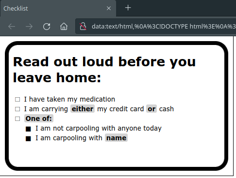

# Checklister
## Introduction

Atul Gawande's book _[The Checklist Manifesto](http://atulgawande.com/book/the-checklist-manifesto/)_ is in the process of changing my life.  I designed a quick-and-dirty template for checklists for myself, written in HTML, and I wanted a simple way of writing multiple checklists that used that template.

## Installation and Usage

The script is mostly self-contained.  It does rely on [Markdown](https://pypi.org/project/Markdown/):

```
pip install markdown
```

After that, create your checklists in Markdown, thus:

```markdown
# Read out loud before you leave home:
- I have taken my medication
- I am carrying ??either?? my credit card ??or?? cash
- ??One of:??
    - I am not carpooling with anyone today
    - I am carpooling with ??name??
```

The `??...??` tag is unique to this software, and is meant to denote "checklist flow control": points where the checklist should be adapted use-by-use for unique situations.  Text within double question marks will be rendered as bold and on an accent background.

Save your checklist into a Markdown file and pass it to the script:

```
python Checklister.py checklist.md
```

Your default browser will automatically open and display the result.



You can either print the web page directly or save it as a PDF.  The 3x5in dimensions are hardcoded into the design.

If you add the `--holes` argument, the page will include two guide circles for hole punches in the top left and top right corners.
